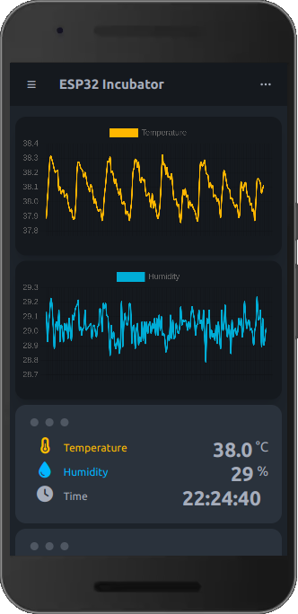

# Incubator

## Table of contents
- [Feature](#feature)  
- [Components Used](#components-used)  
- [Dependencies](#dependencies-and-software)  
- [Troubleshooting](#troubleshooting)  
- [Contributing](#contributing)  
- [Credits](#credits)  
- [License](#license)  

## Feature

- [x] Mesure humidity using GxHT
- [x] Mesure temperature using GxHT
- [x] 4 Relay for controle heating and humidification.
  - [x] Relay 1 can controle Lampe 75w for heat air.
  - [x] Relay 2 can controle Fan to shumidificat air.
  - [x] Relay 3 and Relay 4 for manual controle (Optionel).
- [x] Servo motor SG90 for change position of Egg.
- [x] Sends environmental values to MQTT broker
- [x] Save MQTT data to MariaDB database for analytics
- [] Sends environmental values to Firebase (Optionel)
- [x] Use Telegram to supervise system remotely and send Notification
- [x] Use WebSocket to supervise system (HTML, CSS, JS)
- [x] Includes a keepalive mechanism to regularly check the availability of devices.

## Components Used
The following hardware components are used in this project:  

- `ESP32S (38 pins) microcontroller`: The ESP32S is a powerful microcontroller based on the ESP32 chip, which is designed for Internet of Things (IoT) applications. It has 38 pins and is capable of running at up to 240 MHz. The ESP32S is the main brain of this project and is responsible for controlling all the other components.

- `GxHT30 temperature and humidity sensor`: The GxHT sensor is a digital sensor that can measure both temperature and humidity. It has a range of -40 to 80 degrees Celsius for temperature and 0 to 100% for humidity. The sensor communicates with the ESP32S using a I2C protocol.

- `SG90 Servo Motor`:

- `4 Relay Board`:

## Dependencies and software
The software for this project was developed in Visual Studio Code with PlatformIO extension using the ESP32 board package. The following libraries are used for connecting and communicating with the hardware components:  

## Telegram bot command
Create bot telegram with [@botFather](https://t.me/BotFather) and get api token then set ther command:  
are_you_ok - to know status of module
status - Request current Temperature, Humidity, Relay Status  
relay1_on - Relay1 ON  
relay1_off - Relay1 OFF  
relay2_on - Relay2 ON  
relay2_off - Relay2 OFF  
relay3_on - Relay3 ON  
relay3_off - Relay3 OFF  
relay4_on - Relay4 ON  
relay4_off - Relay4 OFF  
day - Set Egg to Morning position  
noon - Set Egg to Midday position  
night - Set Egg to Night position  
preferences - Get current Temperature, Humidity, ...  
set - Set preferences to t_max, t_min, h_max, h_min, ...  

Use [@myidbot](https://t.me/myidbot) to get `ChatID` 

#### old partition.csv
```
# Name,   Type, SubType, Offset,  Size, Flags
nvs,      data, nvs,     0x9000,  0x5000,
otadata,  data, ota,     0xe000,  0x2000,
app0,     app,  ota_0,   0x10000, 0x300000,
spiffs,   data, spiffs,  0x310000,0xE0000,
```


## Contributing
If you'd like to contribute to this project, please fork the repository and submit a pull request. We welcome contributions to improve the project and add new features.

## Credits
This project was created by H.BENDALI for the Embedded System Design Lab course.

## License
This project is licensed under the MIT License. See the LICENSE file for more information.